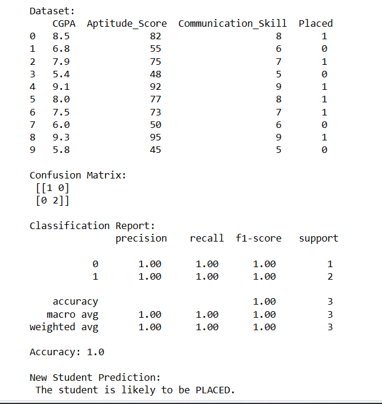

# Implementation-of-Logistic-Regression-Model-to-Predict-the-Placement-Status-of-Student

## AIM:
To write a program to implement the the Logistic Regression Model to Predict the Placement Status of Student.

## Equipments Required:
1. Hardware – PCs
2. Anaconda – Python 3.7 Installation / Jupyter notebook

## Algorithm
1. Prepare a dataset with student attributes like CGPA, aptitude score, and communication skill, along with placement status as the target variable.
2. eparate the dataset into input features and target values, then split it into training and testing sets to build and evaluate the model.
3. Train a Logistic Regression model on the training data to learn the relationship between student attributes and placement outcome.
4. Predict placement for the test set and new student data, then evaluate performance using accuracy, confusion matrix, and classification report.

## Program:
```
/*
Program to implement the the Logistic Regression Model to Predict the Placement Status of Student.
Developed by: G.Kavya
RegisterNumber:  25017268
*/
import numpy as np
import pandas as pd
from sklearn.model_selection import train_test_split
from sklearn.linear_model import LogisticRegression
from sklearn.metrics import accuracy_score, confusion_matrix, classification_report


# Suppose we have: CGPA, Aptitude Score, Communication Skill → Placement (1=Placed, 0=Not Placed)
data = {
    'CGPA': [8.5, 6.8, 7.9, 5.4, 9.1, 8.0, 7.5, 6.0, 9.3, 5.8],
    'Aptitude_Score': [82, 55, 75, 48, 92, 77, 73, 50, 95, 45],
    'Communication_Skill': [8, 6, 7, 5, 9, 8, 7, 6, 9, 5],
    'Placed': [1, 0, 1, 0, 1, 1, 1, 0, 1, 0]
}

df = pd.DataFrame(data)
print("Dataset:\n", df, "\n")

X = df[['CGPA', 'Aptitude_Score', 'Communication_Skill']]
y = df['Placed']


X_train, X_test, y_train, y_test = train_test_split(X, y, test_size=0.3, random_state=42)


model = LogisticRegression()
model.fit(X_train, y_train)

y_pred = model.predict(X_test)


print("Confusion Matrix:\n", confusion_matrix(y_test, y_pred))
print("\nClassification Report:\n", classification_report(y_test, y_pred))
print("Accuracy:", accuracy_score(y_test, y_pred))


new_student = np.array([[8.2, 78, 8]])  # CGPA, Aptitude, Communication
prediction = model.predict(new_student)

print("\nNew Student Prediction:")
if prediction[0] == 1:
    print(" The student is likely to be PLACED.")
else:
    print(" The student is NOT likely to be placed.")
```

## Output:



## Result:
Thus the program to implement the the Logistic Regression Model to Predict the Placement Status of Student is written and verified using python programming.
